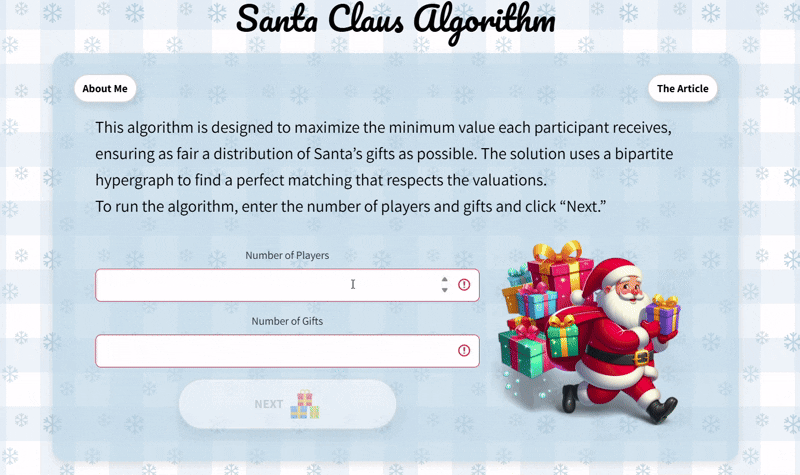

# Santa Claus Algorithm — Web Demo (Flask)

Live demo (desktop+phone): **https://mayrozen45.csariel.xyz/**

This repository contains the **web application** (Flask + JavaScript + HTML/CSS) for running and visualizing an implementation of the **Santa Claus / Max–Min Fair Allocation** algorithm.  
Users enter a valuation matrix (how much each player values each item), and the app computes an allocation that aims to **maximize the minimum total value** received by any player.



> 📌 **Note:** The algorithm implementation is maintained as part of the **`fairpyx`** Python library.  
> This repo is the **website + UI layer** that calls the algorithm.

---

## What is the Santa Claus Problem?

Given:
- `n` players (kids)
- `m` indivisible items (gifts)
- a valuation value `v[i][j] ≥ 0` describing how much player `i` values item `j`

Goal: allocate items so that the **least happy player is as happy as possible**, i.e. maximize:

$$
\max \ \min_i \sum_{j \in S_i} v_{i,j}
$$

---

## Algorithm Overview

This project follows the approach from the paper **“Santa Claus Meets Hypergraph Matchings”**:

1. **Choose a threshold `t`** and ask: “Can every player receive value ≥ `t`?”
2. Solve a **Configuration LP** (a relaxation that allows fractional assignments).
3. Convert the fractional solution into a structured form by classifying items relative to the threshold `t`:
- **Fat item:** an item that alone gives a player value ≥ `t/4`.
- **Thin item:** an item with value < `t/4`, so players need a **bundle** of thin items to reach `t` (often using an inclusion-minimal bundle).
4. Build a **bipartite hypergraph**:
   - Left side: players  
   - Right side: items  
   - Hyper-edges represent *valid bundles* for a player
5. Use a **local search** procedure to find a (near) **perfect hypergraph matching**, which corresponds to a valid allocation.

In practice, this produces an allocation that is guaranteed (theoretically) to be within a constant factor of the LP optimum under the restricted-assignment setting.

---

## Implementation Notes (Tests / Logs / Performance)

To make the paper implementation practical and maintainable (not just theoretically correct), I added:

- **Structured logging (debuggable pipeline):** the algorithm emits detailed `logging` output across the main stages (threshold search, LP solve, hypergraph construction, matching progress, and runtime).  
  The web app also includes a **Logs** button that lets users view these logs directly in the UI.

- **Tests (doctest-based):** core functions include embedded **doctests** that validate correctness on small, representative instances (e.g., feasibility checks, allocations, and edge cases).

- **Performance-minded implementation:** to keep the LP + hypergraph stages tractable, the code uses  
  **caching (LRU memoization)** for repeated subset/value computations (e.g., combinations and bundle values),  
  **minimal-bundle pruning** to reduce the search space, and **hyperedge de-duplication** to avoid redundant edges.

---

## Web App — How It Looks & Works

The website is designed to be simple and interactive:

1. **Home screen**: choose the number of players and gifts (with validation: players ≤ items).
2. **Valuation input**: fill a matrix where each row is a player and each column is an item.  
**Note (restricted-assignment input):** each gift has a fixed value (e.g., 10).  
For any player, that gift is either **available** (enter the fixed value) or **not available** (enter **0**).  
So players do not choose arbitrary values per gift — each cell is either the gift’s value or 0.
3. **Run**: the server calls the Python algorithm and returns:
   - the final allocation (which items each player got)
   - summary/fairness information (e.g., the minimum achieved value)

---

## Tech Stack

- **Backend:** Python, Flask  
- **Frontend:** HTML, CSS, JavaScript  
- **Algorithm:** implemented in Python as part of **`fairpyx`**

---

## Related Repositories

- **This repo (Web App):**  
  https://github.com/MayRozen/App-Research-Algorithms

- **Algorithm library (`fairpyx`) — my fork:**  
  https://github.com/MayRozen/fairpyx

- **Upstream `fairpyx` (official / main):**  
  https://github.com/ariel-research/fairpyx
  
- **Paper (DOI):**  
  [Santa Claus Meets Hypergraph Matchings](https://doi.org/10.1145/2229163.2229168)
---

## Installation (Algorithm Library)

The Santa Claus algorithm is provided by the `fairpyx` Python library.

### Public release (PyPI)
You can install the published version via pip:

```bash
pip install fairpyx
```

### Required for this project (includes the Santa algorithm)

This web demo requires the latest fairpyx version from GitHub (the PyPI release does not yet include the Santa module):

```bash
pip install git+https://github.com/ariel-research/fairpyx.git
```

### Usage

```bash
from fairpyx.algorithms.santa_algorithm import santa_claus_main
```

---

## Installation (Web App)

Clone this repository and run the Flask app locally:

```bash
git clone https://github.com/MayRozen/App-Research-Algorithms.git
cd App-Research-Algorithms

python -m venv .venv
# Windows: .venv\Scripts\activate
source .venv/bin/activate

pip install -r requirements.txt

# Install the algorithm backend (Santa module) from GitHub:
pip install git+https://github.com/ariel-research/fairpyx.git

# Run the web app
python app.py
```
Then open: http://127.0.0.1:5000


